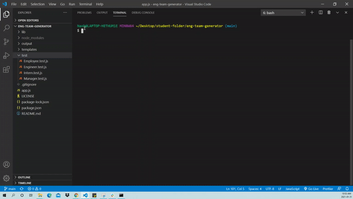
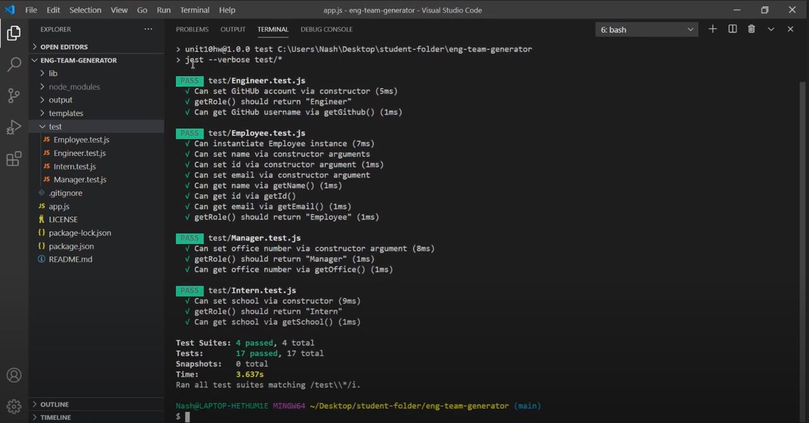
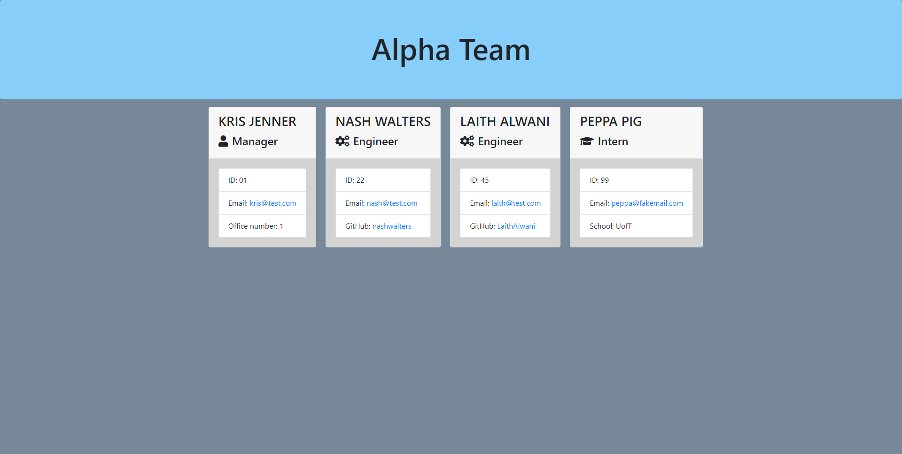

# Team Generator

## Table of Contents
* [Description](#description)
* [Installation](#installation)
  * [Nodejs](#nodejs)
  * [Dependencies](#dependencies)
* [Usage](#usage)
  * [Demo](#demo)
  * [Screenshots](#screenshots)
  * [Tips](#tips)
* [Tests](#tests)
* [Contributing](#contributing)
* [Questions](#questions)
* [Credits](#credits)
* [License](#license)

## Description
This is a command line application that takes in information about employees and generates an HTML webpage that displays summaries for each person. An application like this can be useful for a manger who wants to be able to access information about his/her team quickly. 

There are also unit tests that were used to bulid the classes necessary.

## Installation
Node.js, the npm's inquirer, jest and axios are needed for this application.

### Nodejs 
<a href=""></a>

Node.js is required on your local machine. To download Node.js please visit [Node.js download](https://nodejs.org/en/download/).

To ensure Node.js has been installed, run the below command in your terminal - you should get something like v6.14.10.
```
$ node -v
```

### Dependencies 
<a href=""></a>

[Inquirer.js](https://www.npmjs.com/package/inquirer) package was used, run the below command in the terminal for the needed node modules.
```
$ npm i inquirer
```
[Jest](https://jestjs.io/en/) is a powerful way for having access to test runner and assertion library for Node. js applications. Jest is used as a dev dependency and there no need to import or require the package. to install jest run the below command in the terminal.
```
$ npm install --save-dev jest
```
[Axios](https://www.npmjs.com/package/axios) is a promise-based HTTP client that is used to make http requests from node.js. In the application axios is used to validate the github username. To install run the below command in your terminal.
```
$ npm install axios
```
## Usage
The application is invoked by using the following command:
```
$ node app.js
```
When the command is invoked, the user is prompted for to add information about the manager, engineer and intern. The user can input any number of team members, and they can be a mix of engineers and interns. The user's response is taken and the application creates an HTML file that displays a team rosster based on the information given. All questions have a function that validates the users answer to ensure that the information the user provides is in a format that is expected.

#### Demo
click [demo](https://drive.google.com/file/d/1UOM7_gLX0SNUiNuda21ENJuT3ODnO2kq/view)

#### Screenshots




#### Tips
1. To try this application you are able to clone this repo or download a zip file to your local machine.

2. If you have cloned a repo and a package.json exists, you are able to see the dependencies and dev dependecies used in the application. If this is the case run the below comand to get all the depencies need for that application.
```
$ npm i
```

## Tests                           

Enter the below command in terminal to run tests.

```
$ npm run test
```

## Contributing   


Please first discuss the change you wish to make via issue or email, before making a change.

Steps to contribute: 
1. Fork the repo on GitHub.
2. Clone the project to your own machine.
3. Commit changes to your own branch.
4. Push your work back up to your fork/branch
5. Submit a Pull Request so that we can review your changes

## Questions  
<a href="https://github.com/nashwalters"></a>  

If you have any questions, I can be reached via:
* <bold>Email</bold>: nash.walters@outlook.com

## Credits
* [Adam Simonini](https://github.com/adamsimonini)
* Carleton University Coding Bootcamp

## License     
<a href=""></a>

Copyright © 2021 Nash Walters,

Released under the [MIT](https://github.com/nashwalters/eng-team-generator/blob/main/LICENSE) license.
